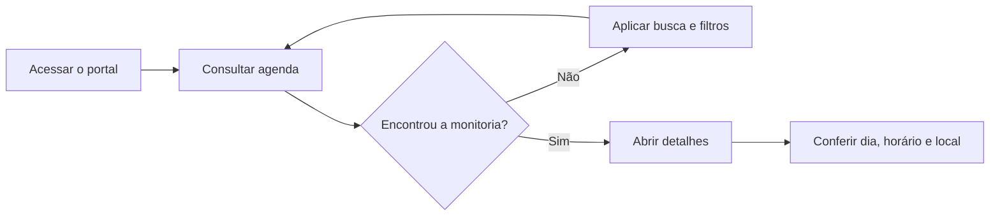
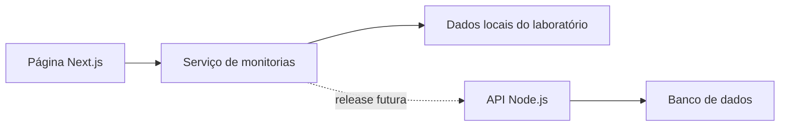

# Lab Next.js: Portal de Monitorias

Construção guiada de uma aplicação web para consultar monitorias do curso de Ciência da Computação. O laboratório usa um problema realista para apresentar os fundamentos de React e Next.js com App Router.

O resultado é uma agenda semanal pública com busca, filtros e uma página de detalhes para cada monitoria.

## Tecnologias utilizadas

<div style="display: flex; gap: 12px; align-items: center;">
  
  
  
  
  
</div>

## Onde aplicar

Os conceitos deste laboratório aparecem em aplicações como:

- portais acadêmicos;
- catálogos e agendas;
- dashboards e sistemas internos;
- aplicações que consomem APIs;
- produtos com páginas públicas e áreas autenticadas.

## Objetivos de aprendizagem

Ao concluir o laboratório, você deverá ser capaz de:

- explicar o papel de React e Next.js em uma aplicação web;
- criar rotas com o App Router;
- separar componentes de servidor e de cliente;
- organizar uma funcionalidade por domínio;
- buscar e filtrar dados de forma assíncrona;
- usar parâmetros de URL para representar o estado dos filtros;
- criar rotas dinâmicas;
- tratar carregamento, erro, resultado vazio e página inexistente;
- aplicar estilos locais com CSS Modules;
- utilizar `Link`, fontes e metadados do Next.js;
- reconhecer pontos de integração com uma API Node.js.

## Escopo funcional

O laboratório implementa a primeira release pública do Portal de Monitorias:

1. visualizar a agenda semanal;
2. buscar por disciplina, código ou monitor;
3. filtrar por campus, disciplina, dia e monitor;
4. acessar os detalhes de uma monitoria;
5. compartilhar uma busca por meio da URL;
6. receber feedback quando não há resultados ou ocorre um erro.

O cadastro de monitorias, autenticação e registro de presença pertencem a releases futuras. Eles aparecem apenas como desafios de evolução.

# Sumário

- [Preparação](#preparação)
- [Contexto do produto](#contexto-do-produto)
- [React e Next.js](#react-e-nextjs)
- [Roadmap do laboratório](#roadmap-do-laboratório)
- [Etapa 1: App Router e layout](#etapa-1-app-router-e-layout)
- [Etapa 2: componentes e estilos](#etapa-2-componentes-e-estilos)
- [Etapa 3: dados no servidor](#etapa-3-dados-no-servidor)
- [Etapa 4: interação no cliente](#etapa-4-interação-no-cliente)
- [Etapa 5: rotas dinâmicas](#etapa-5-rotas-dinâmicas)
- [Etapa 6: estados da interface](#etapa-6-estados-da-interface)
- [Etapa 7: otimização e acessibilidade](#etapa-7-otimização-e-acessibilidade)
- [Validação](#validação)
- [Desafios](#desafios)
- [Estrutura do projeto](#estrutura-do-projeto)
- [Referências](#referências)

## Preparação

### Pré-requisitos

- Node.js 20.9 ou superior;
- npm;
- Git;
- editor de código;
- conhecimentos básicos de HTML, CSS, JavaScript e React.

### Instalação

Clone o repositório e entre na pasta:

```bash
git clone URL_DO_REPOSITORIO
cd lab-portal-monitorias-nextjs
```

Instale as dependências:

```bash
npm install
```

Inicie o servidor de desenvolvimento:

```bash
npm run dev
```

Acesse [http://localhost:3000](http://localhost:3000).

### Comandos disponíveis

| Comando | Finalidade |
| --- | --- |
| `npm run dev` | Inicia o ambiente de desenvolvimento |
| `npm run build` | Gera e valida a versão de produção |
| `npm run start` | Executa a versão gerada pelo build |
| `npm run lint` | Analisa padrões e possíveis problemas no código |
| `npm run typecheck` | Valida os tipos TypeScript sem gerar arquivos |

## Contexto do produto

Estudantes nem sempre sabem quando e onde uma monitoria acontece. As informações podem estar espalhadas em mensagens, planilhas e avisos, além de sofrer mudanças durante o semestre.

O Portal de Monitorias centraliza essas informações em uma agenda semanal. A consulta é pública porque o estudante precisa chegar à informação com o menor atrito possível.

### Personas envolvidas

| Persona | Necessidade principal | Participação nesta release |
| --- | --- | --- |
| Estudante | Encontrar uma monitoria compatível com sua necessidade e horário | Consulta a agenda e os detalhes |
| Monitor | Conhecer as monitorias pelas quais é responsável | Aparece como informação da agenda |
| Coordenação | Manter horários e responsáveis atualizados | Alimenta os dados em uma release futura |

### Fluxo principal



## React e Next.js

### O papel do React

React permite construir interfaces a partir de componentes. Cada componente encapsula parte da estrutura e do comportamento da tela, recebe dados por propriedades e pode reagir a mudanças de estado.

Neste projeto, filtros, agenda, cabeçalho e eventos são responsabilidades diferentes. Separá-los reduz repetição e facilita a evolução da aplicação.

### O papel do Next.js

Next.js adiciona uma estrutura de aplicação ao React. O framework fornece recursos como:

- roteamento baseado em arquivos;
- renderização no servidor;
- separação entre componentes de servidor e de cliente;
- layouts compartilhados;
- metadados;
- estados de carregamento e erro;
- otimizações de navegação, fontes e imagens.

### App Router

O laboratório usa o App Router. A URL é determinada pela estrutura dentro de `src/app`:

```text
src/app/
├── layout.tsx
├── page.tsx
└── monitorias/
    ├── page.tsx
    ├── loading.tsx
    ├── error.tsx
    └── [id]/
        └── page.tsx
```

| Arquivo | URL ou responsabilidade |
| --- | --- |
| `app/page.tsx` | Redireciona `/` para `/monitorias` |
| `app/monitorias/page.tsx` | Renderiza `/monitorias` |
| `app/monitorias/[id]/page.tsx` | Renderiza uma rota dinâmica |
| `app/layout.tsx` | Compartilha estrutura, fonte e metadados |
| `loading.tsx` | Exibe o estado de carregamento |
| `error.tsx` | Captura erros da rota |

## Roadmap do laboratório

| Etapa | Conceito técnico | Entrega no produto |
| --- | --- | --- |
| 1 | App Router e layouts | Estrutura de navegação |
| 2 | Componentes e CSS Modules | Cabeçalho, filtros e agenda |
| 3 | Server Components e funções assíncronas | Monitorias carregadas no servidor |
| 4 | Client Components e URL | Busca e filtros interativos |
| 5 | Rotas dinâmicas e `Link` | Detalhes da monitoria |
| 6 | Loading, erro, vazio e 404 | Fluxo resiliente |
| 7 | Metadados e acessibilidade | Experiência pronta para validação |

## Etapa 1: App Router e layout

O `layout.tsx` envolve as páginas filhas. É o local adequado para estruturas compartilhadas, como o cabeçalho, a fonte e os metadados gerais.

```tsx
export default function RootLayout({ children }: { children: React.ReactNode }) {
  return (
    <html lang="pt-BR">
      <body>
        <SiteHeader />
        {children}
      </body>
    </html>
  );
}
```

O arquivo `src/app/page.tsx` usa `redirect` porque o conteúdo principal está em `/monitorias`:

```tsx
import { redirect } from "next/navigation";

export default function HomePage() {
  redirect("/monitorias");
}
```

### Hora de praticar 01

1. Execute o projeto.
2. Localize `src/app/layout.tsx`.
3. Altere temporariamente o título padrão da aplicação.
4. Acesse `/` e confirme o redirecionamento.
5. Acesse diretamente `/monitorias`.

**Checkpoint:** o cabeçalho deve continuar visível nas duas rotas do produto.

## Etapa 2: componentes e estilos

Componentes devem representar responsabilidades claras. Neste laboratório, a página orquestra os dados e delega a apresentação para componentes específicos:

```tsx
<FilterBar filters={filters} options={options} />
<WeeklyAgenda sessions={sessions} />
```

### Propriedades

As propriedades permitem reutilizar um componente com dados diferentes. `WeeklyAgenda` não conhece a origem das monitorias; ela apenas recebe uma lista:

```tsx
type WeeklyAgendaProps = {
  sessions: MonitoringSession[];
};
```

### CSS Modules

Arquivos terminados em `.module.css` geram classes locais. Isso reduz colisões de nomes e mantém os estilos próximos ao componente.

```tsx
import styles from "./weekly-agenda.module.css";

export function WeeklyAgenda() {
  return <section className={styles.section}>...</section>;
}
```

As cores recorrentes ficam em variáveis globais:

```css
:root {
  --color-primary: #3451c6;
  --color-text: #172034;
  --color-border: #e2e6ed;
}
```

### Hora de praticar 02

1. Abra `src/features/monitorias/components/weekly-agenda.tsx`.
2. Identifique o cabeçalho de dias, as faixas de horário e os eventos.
3. Adicione um rótulo visual para monitorias no campus de sua escolha.
4. Mantenha a regra no componente, sem duplicar os dados.

**Checkpoint:** a agenda deve permanecer alinhada e cada monitoria deve continuar sendo um link.

## Etapa 3: dados no servidor

Componentes dentro do App Router são Server Components por padrão. Eles podem executar funções assíncronas e preparar os dados antes de enviar HTML ao navegador.

```tsx
export default async function MonitoringPage({ searchParams }: MonitoringPageProps) {
  const params = await searchParams;

  const [sessions, options] = await Promise.all([
    getMonitoringSessions(filters),
    getMonitoringFilterOptions(),
  ]);

  return <WeeklyAgenda sessions={sessions} />;
}
```

### Camada de serviço

A página não acessa o array de dados diretamente. `monitoring-service.ts` concentra consultas e filtros. Em outro workshop, essa implementação poderá ser trocada por chamadas à API Node.js sem redesenhar os componentes.

```ts
export async function getMonitoringSessions(filters: MonitoringFilters) {
  return monitoringSessions.filter((session) => {
    // regras de filtragem
  });
}
```

### Dados simulados e API real

Neste laboratório, os dados locais tornam a prática independente do backend. A evolução esperada é:



### Hora de praticar 03

1. Abra `monitoring-sessions.ts`.
2. Cadastre uma nova monitoria com um `id` único.
3. Use um dos horários existentes na grade.
4. Confirme que a agenda exibe o novo item sem alterações na página.

**Checkpoint:** os dados devem surgir na agenda por meio do serviço, não por JSX duplicado.

## Etapa 4: interação no cliente

Busca, eventos e APIs do navegador exigem um Client Component. O arquivo `filter-bar.tsx` começa com:

```tsx
"use client";
```

Essa diretiva cria uma fronteira. Apenas a parte interativa precisa ser enviada como JavaScript para o navegador; a página e a agenda continuam sendo componentes de servidor.

### Estado na URL

Em vez de manter os filtros somente em `useState`, o formulário os grava na query string:

```text
/monitorias?campus=Praca+da+Liberdade&weekday=quinta
```

Isso produz três benefícios:

- a busca pode ser compartilhada;
- atualizar a página não perde os filtros;
- o servidor recebe o estado e retorna a agenda filtrada.

```tsx
const router = useRouter();
const pathname = usePathname();

router.push(`${pathname}?${params.toString()}`);
```

### Hooks utilizados

| Hook | Uso no laboratório |
| --- | --- |
| `useRouter` | Executa a navegação após o envio do formulário |
| `usePathname` | Preserva a rota atual |
| `useSearchParams` | Verifica os filtros presentes na URL |

### Hora de praticar 04

1. Filtre a agenda por campus.
2. Copie a URL e abra em outra aba.
3. Confirme que o estado foi preservado.
4. Implemente um novo filtro por código da disciplina ou adapte a busca existente.

**Checkpoint:** atualizar a página deve manter o mesmo conjunto de resultados.

## Etapa 5: rotas dinâmicas

Uma pasta entre colchetes representa um segmento dinâmico. A rota abaixo recebe o identificador da monitoria:

```text
src/app/monitorias/[id]/page.tsx
```

No componente, `params` é assíncrono:

```tsx
export default async function MonitoringDetailsPage({ params }: Props) {
  const { id } = await params;
  const session = await getMonitoringSessionById(id);

  if (!session) notFound();
}
```

### Navegação com Link

`Link` permite navegação interna com pré-carregamento e sem recarregar o documento inteiro:

```tsx
<Link href={`/monitorias/${session.id}`}>
  {session.discipline}
</Link>
```

### Metadados dinâmicos

A página de detalhes usa `generateMetadata` para alterar o título de acordo com a disciplina.

### Hora de praticar 05

1. Abra uma monitoria pela agenda.
2. Observe o `id` na URL e o título da aba.
3. Digite um identificador inexistente.
4. Confirme que o sistema apresenta a página 404.

**Checkpoint:** cada evento da agenda deve apontar para uma URL única e legível.

## Etapa 6: estados da interface

Uma experiência completa não trata apenas o cenário de sucesso.

| Estado | Implementação | Quando aparece |
| --- | --- | --- |
| Carregamento | `loading.tsx` | Enquanto a rota é preparada |
| Erro | `error.tsx` | Quando ocorre uma exceção na rota |
| Vazio | `WeeklyAgenda` | Quando os filtros não retornam itens |
| Não encontrado | `not-found.tsx` | Quando o identificador não existe |

O `error.tsx` é um Client Component porque o botão de nova tentativa chama `reset()`.

### Hora de praticar 06

1. Busque por uma disciplina inexistente.
2. Avalie se a mensagem indica como sair do estado vazio.
3. Altere temporariamente o serviço para lançar um erro.
4. Use o botão de nova tentativa e depois restaure o serviço.

**Checkpoint:** nenhum cenário deve resultar em uma tela vazia ou sem próximo passo.

## Etapa 7: otimização e acessibilidade

### Fontes

`next/font` baixa e hospeda a fonte junto da aplicação, evitando dependência de uma requisição externa no navegador:

```tsx
import { Inter } from "next/font/google";

const inter = Inter({ subsets: ["latin"], display: "swap" });
```

### Metadados

O objeto `metadata` define título e descrição. Páginas filhas podem complementar o título usando o template do layout.

### Acessibilidade aplicada

O projeto inclui:

- idioma da página com `lang="pt-BR"`;
- landmarks como `header`, `nav`, `main`, `section` e `aside`;
- rótulos associados aos campos;
- foco visível;
- ícones decorativos ocultos de tecnologias assistivas;
- tabela de agenda navegável horizontalmente por teclado;
- mensagens de estado com texto, sem depender apenas da cor.

### Hora de praticar 07

1. Navegue pela agenda usando apenas `Tab` e `Shift + Tab`.
2. Confirme que o foco está sempre visível.
3. Inspecione a hierarquia de títulos.
4. Use a ferramenta Lighthouse ou o painel Accessibility do navegador para revisar a página.

**Checkpoint:** busca, filtros, agenda e detalhes devem ser utilizáveis sem mouse.

## Validação

Antes de considerar o laboratório concluído, execute:

```bash
npm run lint
npm run typecheck
npm run build
```

### Critérios de aceite

- [ ] A agenda apresenta pelo menos seis monitorias.
- [ ] Os horários estão organizados por dia e faixa de horário.
- [ ] A busca considera disciplina, código, monitor e sala.
- [ ] Os filtros alteram a URL.
- [ ] Limpar os filtros restaura a agenda completa.
- [ ] Cada monitoria possui uma rota de detalhes.
- [ ] Um `id` inválido apresenta a página 404.
- [ ] Há estados de carregamento, erro e resultado vazio.
- [ ] `npm run lint`, `npm run typecheck` e `npm run build` terminam sem erros.

## Desafios

Depois da entrega principal, escolha uma evolução em [DESAFIOS.md](./DESAFIOS.md).

Sugestão de ordem:

1. integração com uma API Node.js;
2. painel de coordenação com CRUD;
3. autenticação institucional;
4. registro de presença do monitor;
5. histórico de alterações.

## Estrutura do projeto

```text
lab-portal-monitorias-nextjs/
├── docs/
│   └── roteiro-do-instrutor.md
├── src/
│   ├── app/
│   │   ├── monitorias/
│   │   │   ├── [id]/page.tsx
│   │   │   ├── error.tsx
│   │   │   ├── loading.tsx
│   │   │   └── page.tsx
│   │   ├── globals.css
│   │   ├── layout.tsx
│   │   └── page.tsx
│   ├── features/
│   │   └── monitorias/
│   │       ├── components/
│   │       ├── data/
│   │       ├── services/
│   │       └── types/
│   └── shared/
│       └── components/
├── .env.example
├── DESAFIOS.md
├── package.json
└── README.md
```

### Decisões de organização

- `app`: rotas, layouts e arquivos especiais do Next.js;
- `features`: código agrupado pelo domínio de monitorias;
- `shared`: componentes que podem ser usados por várias funcionalidades;
- `data`: dados simulados substituíveis por uma API;
- `services`: regras de consulta e ponto de integração com o backend;
- `types`: contratos TypeScript do domínio.

## Referências

- [Documentação do Next.js](https://nextjs.org/docs)
- [App Router](https://nextjs.org/docs/app)
- [Server e Client Components](https://nextjs.org/docs/app/getting-started/server-and-client-components)
- [Busca de dados](https://nextjs.org/docs/app/getting-started/fetching-data)
- [Navegação](https://nextjs.org/docs/app/getting-started/linking-and-navigating)
- [TypeScript](https://www.typescriptlang.org/docs/)

## Licença

Distribuído sob a licença MIT. Consulte [LICENSE](./LICENSE).
